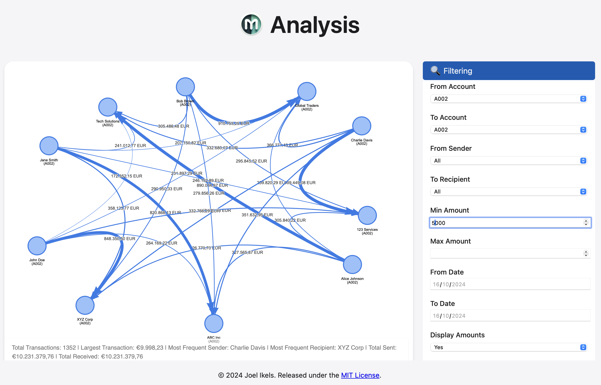

# Moneyflow

Moneyflow is a transaction analysis tool designed to help you visualize and understand your financial flows. Born out of a desire to analyze bank transactions more effectively, this application provides an intuitive interface for exploring complex financial data.

## Features

- **Transaction Visualization**: Generate interactive graphs of your financial transactions, allowing you to see the flow of money between accounts and entities.

- **Summary Statistics**: Get quick insights with summary statistics displayed as a watermark on your graphs.
- **Filtering Capabilities**: Easily filter transactions based on various criteria such as date range, amount, sender, and recipient.
- **Detailed Transaction View**: View detailed information about specific transactions or groups of transactions.

- **Data Export**: Export filtered transaction data as CSV for further analysis in other tools.
- **Graph Annotation**: Annotate and customize your transaction graphs for better understanding and presentation.


## Installation

Moneyflow is containerized using Docker for easy deployment. Follow these steps to get it running:

1. Ensure you have Docker installed on your system.

2. Clone the repository:
   ```
   git clone https://github.com/jikels/moneyflow.git
   cd moneyflow
   ```

3. Pull the Python 3.10 slim image:
   ```
   docker pull python:3.10-slim
   ```

4. Build the Docker image:
   ```
   docker build -t moneyflow-app .
   ```

5. Run the Docker container:
   ```
   docker run -p 5000:5000 moneyflow-app
   ```

6. Access the application by opening a web browser and navigating to `http://localhost:5000`.

## Usage

1. Start by uploading your CSV file containing transaction data on the intro page.


```63:69:src/templates/intro.html
            <h2>Upload Your Transaction CSV</h2>
            <form action="{{ url_for('upload_csv') }}" method="post" enctype="multipart/form-data" class="upload-form">
                <input type="file" name="csv_file" id="csv_file" class="file-input" accept=".csv" required>
                <label for="csv_file" class="file-label">Choose CSV File</label>
                <div id="file-name"></div>
                <button type="submit" class="submit-button">Upload and Visualize</button>
            </form>
```


2. Once uploaded, you'll be taken to the main visualization page where you can interact with your transaction graph.

3. Use the filtering options in the sidebar to refine your view of the data.

4. Click on nodes or edges in the graph to view detailed transaction information.

5. Use the annotation tools to customize your graph as needed.

6. Export your data or graph image for external use or presentation.

## Data Format

Your input CSV should contain the following columns:
- Date
- From Account
- From Sender
- To Account
- To Recipient
- Amount in Euro

An example of how this data might be structured can be found in the `generate_sample_data` function:


```19:50:src/example_data.py
    with open(filename, 'w', newline='') as csvfile:
        fieldnames = ['Date', 'From Account', 'From Sender', 'To Account', 'To Recipient', 'Amount in Euro']
        writer = csv.DictWriter(csvfile, fieldnames=fieldnames)

        writer.writeheader()
        start_date = datetime(2023, 1, 1)
        for _ in range(num_records):
            date = start_date + timedelta(days=random.randint(0, 365))
            
            # 30% chance of using a biased pair
            if random.random() < 0.3:
                from_sender, to_recipient = random.choice(biased_pairs)
                from_account = random.choice(accounts)
                to_account = random.choice(accounts)
            else:
                from_sender = random.choice(senders)
                to_recipient = random.choice(recipients)
                from_account = random.choice(accounts)
                to_account = random.choice(accounts)

            # 10% chance of internal transfer (same account)
            if random.random() < 0.1:
                to_account = from_account

            writer.writerow({
                'Date': date.strftime('%Y-%m-%d'),
                'From Account': from_account,
                'From Sender': from_sender,
                'To Account': to_account,
                'To Recipient': to_recipient,
                'Amount in Euro': round(random.uniform(100, 10000), 2)
            })
```


## License

This project is licensed under the MIT License. See the LICENSE file for details.

## Contributing

Contributions are welcome! Please feel free to submit a Pull Request.