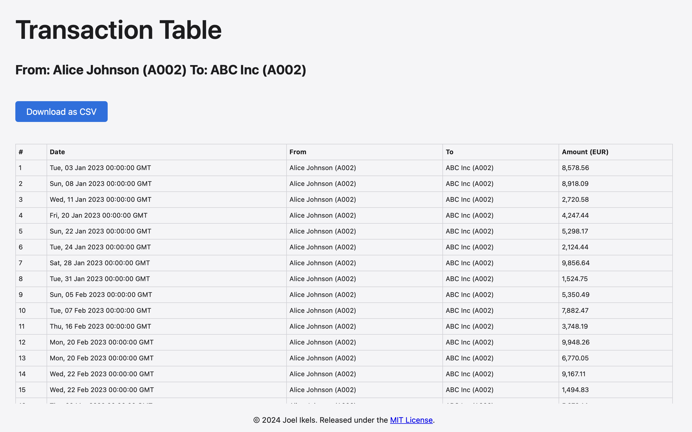
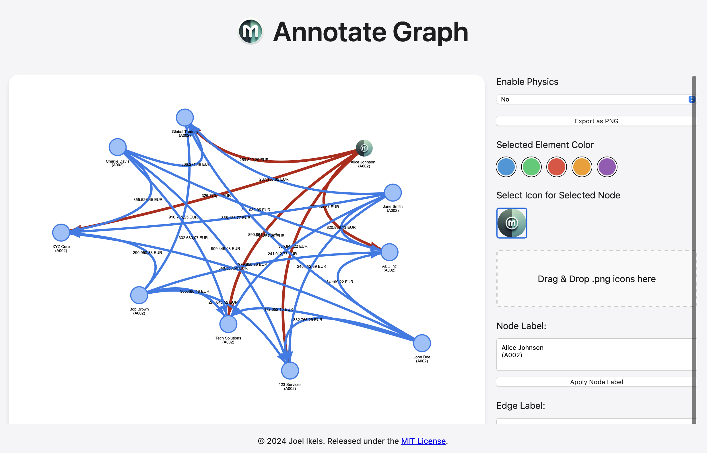

#  moneyflow

Moneyflow is a transaction analysis tool designed to help you visualize and understand your financial flows. Born out of a desire to analyze bank transactions more effectively, this application provides an intuitive interface for exploring complex financial data.


## Features

- **Transaction Visualization**: Generate interactive graphs of your financial transactions, allowing you to see the flow of money between accounts and entities.
  
- **Summary Statistics**: Get quick insights with summary statistics displayed as a watermark on your graphs.
- **Filtering Capabilities**: Easily filter transactions based on various criteria such as date range, amount, sender, and recipient.
- **Detailed Transaction View**: View detailed information about specific transactions or groups of transactions.
  
- **Data Export**: Export filtered transaction data as CSV for further analysis in other tools.
- **Graph Annotation**: Annotate and customize your transaction graphs for better understanding and presentation.
  

## Installation and Running

Moneyflow can be deployed using Docker or as a standalone executable with PyInstaller.

### Option 1: Running with Docker

1. Ensure you have Docker installed on your system.

2. Clone the repository:
   ```bash
   git clone https://github.com/jikels/moneyflow.git
   cd moneyflow
   ```

3. Pull the Python 3.10 slim image:
   ```bash
   docker pull python:3.10-slim
   ```

4. Build the Docker image:
   ```bash
   docker build -t moneyflow-app .
   ```

5. Run the Docker container using one of the following commands:

   - **Option A (recommended for most systems)**:
     ```bash
     docker run -p 5001:5001 moneyflow-app
     ```

   - **Option B (alternative if Option A doesn't work)**:
     ```bash
     docker run --network host moneyflow-app
     ```

6. Access the application by opening a web browser and navigating to `http://localhost:5001`.

### Option 2: Running with PyInstaller

If you prefer not to use Docker, you can build and run Moneyflow as a standalone executable using PyInstaller.

1. Make sure you have Python and PyInstaller installed on your system.

2. Clone the repository:
   ```bash
   git clone https://github.com/jikels/moneyflow.git
   cd moneyflow
   ```

3. Run the following PyInstaller command to build the executable:
   ```bash
   pyinstaller --onefile --add-data "src/templates:templates"    --add-data "src/static:static" src/app.py    --hidden-import _sqlite3    --hidden-import mmap    --hidden-import pyexpat
   ```

4. After building, navigate to the `dist` directory where the executable (`app` or `app.exe`) will be located. Run the application with:
   ```bash
   ./dist/app
   ```

5. Open a web browser and go to `http://localhost:5001` to access the application.

## Usage

1. Start by uploading your CSV file containing transaction data on the intro page.

2. Once uploaded, you'll be taken to the main visualization page where you can interact with your transaction graph.

3. Use the filtering options in the sidebar to refine your view of the data.

4. Click on nodes or edges in the graph to view detailed transaction information.

5. Use the annotation tools to customize your graph as needed.

6. Export your data or graph image for external use or presentation.

## Data Format

Your input CSV should contain the following columns:
- Date
- From Account
- From Sender
- To Account
- To Recipient
- Amount in Euro

## License

This project is licensed under the MIT License. See the LICENSE file for details.

## Contributing

Contributions are welcome! Please feel free to submit a Pull Request.
